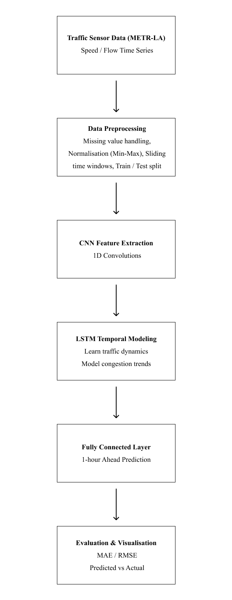

# Short-Term Traffic Speed Forecasting with CNN-LSTM

End-to-end deep learning pipeline that predicts **traffic speeds across 207 Los Angeles freeway sensors** using historical readings from the **METR-LA** benchmark dataset. A hybrid **CNN-LSTM** model captures spatial patterns between sensors and temporal congestion trends for short-horizon forecasting.

**Author:** [Srigayaththri Tharmasoruban](https://github.com/Gayaththri)

---

## Problem

Traffic congestion increases travel time, fuel consumption, and emissions. Transportation systems need accurate short-term speed forecasts to support routing, signal timing, and proactive congestion management.

---

## Approach

| Stage | Description |
|-------|-------------|
| **Data** | METR-LA multivariate time series — 207 sensors, 5-minute intervals |
| **Preprocessing** | Missing-value handling, Min-Max scaling, sliding windows (12 steps = 1 hour) |
| **Model** | Conv1D → LSTM → Dense output layer |
| **Evaluation** | MAE, RMSE, baseline comparison, per-sensor and per-timestep analysis |

Compared **linear regression**, **MLP**, and **CNN-LSTM** during design; CNN-LSTM was selected for its ability to model spatiotemporal traffic dynamics.

---

## Results

| Metric | Test set |
|--------|----------|
| **MAE** | ~5.22 mph |
| **RMSE** | ~10.62 mph |
| **Per-sensor MAE** | 5.22 ± 2.32 mph |

**Best sensor:** ID 1 (~2.20 mph) · **Worst sensor:** ID 174 (~16.34 mph)

Includes predicted-vs-actual plots, error distributions, and naive-persistence baseline comparison.

---

## Architecture

```
METR-LA sensor data
        ↓
  Preprocessing (imputation, scaling, sliding windows)
        ↓
  Conv1D (64 filters) — spatial patterns across sensors
        ↓
  LSTM (64 units) — temporal traffic dynamics
        ↓
  Dense (207 outputs) — next-step speed forecast
        ↓
  Evaluation (MAE / RMSE)
```



~86K parameters · Adam · MSE loss · 15 epochs

---

## Tech Stack

Python · TensorFlow/Keras · pandas · NumPy · scikit-learn · Matplotlib

---

## Project Structure

```
├── README.md
├── requirements.txt
├── traffic_forecasting_cnn_lstm.ipynb
└── docs/
    └── architecture.png
```

---

## Quick Start

```bash
git clone https://github.com/Gayaththri/cnn-lstm-traffic-forecasting.git
cd cnn-lstm-traffic-forecasting
pip install -r requirements.txt
jupyter notebook traffic_forecasting_cnn_lstm.ipynb
```

The notebook downloads **METR-LA** from [Zenodo](https://zenodo.org/record/5146275) on first run (~70 MB).

Runs on CPU; GPU optional for faster training.

---

## Methodology

| Parameter | Value |
|-----------|-------|
| Input window | 12 timesteps (1 hour) |
| Forecast horizon | 1 step (5 minutes) |
| Sensors | 207 |
| Train / test split | 70% / 30% (chronological) |
| Normalization | Min-Max [0, 1] |

---

## Key Skills

- Time-series feature engineering (sliding windows, leakage-free splits)
- Hybrid deep learning for spatiotemporal data
- Regression metrics and baseline benchmarking
- Exploratory analysis and model visualisation

---

## Dataset

**METR-LA** — real freeway speed readings from 207 loop detectors in Los Angeles.

[Zenodo record](https://zenodo.org/record/5146275) · Commonly used in traffic forecasting research

---

## Contact

[@Gayaththri](https://github.com/Gayaththri)
